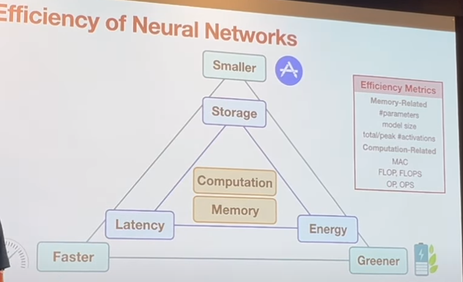
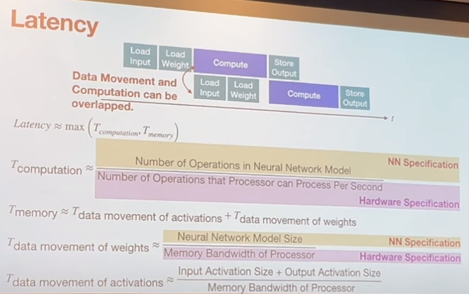
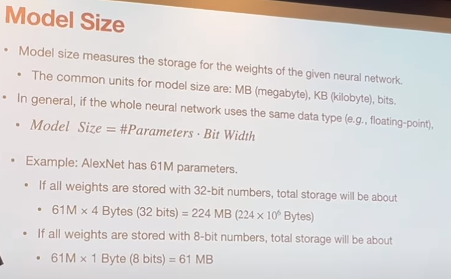
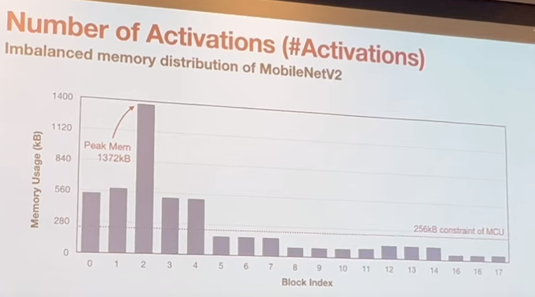
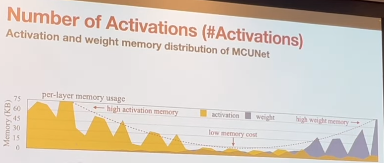
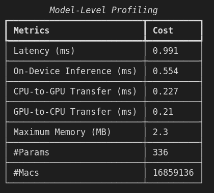
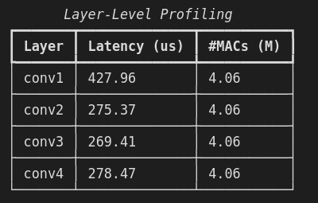
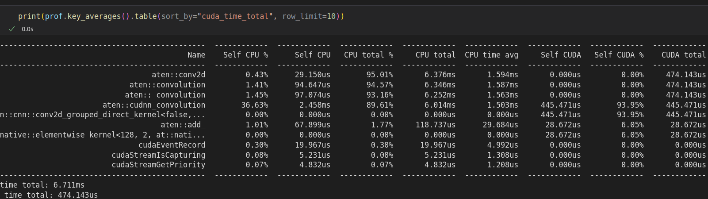
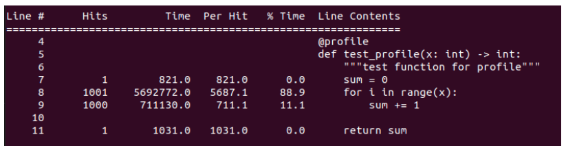
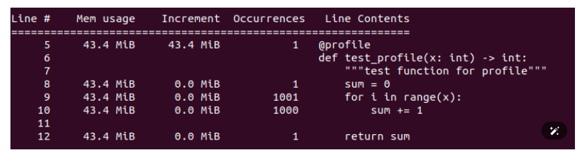

# PyTorch Profiler
Profile your PyTorch model with model-level, layer-level, and operator-level details.

## Table of contents
- [PyTorch Profiler](#pytorch-profiler)
  - [Table of contents](#table-of-contents)
  - [Introduction](#introduction)
  - [File Structure](#file-structure)
  - [Popular Efficiency Metrics](#popular-efficiency-metrics)
  - [Toolboxes](#toolboxes)
  - [Installation](#installation)
  - [Quickstart](#quickstart)
  - [Examples](#examples)
  - [Best Practices](#best-practices)
  - [Other Resources](#other-resources)

## Introduction
In deployment, identifying the bottleneck of our model is crucial. Typically, we analyze the cost from the model level down to the operator level. In this tutorial, we will show you a step-by-step guide to profile your PyTorch models.
## File Structure
```bash
.
├── README.md # main documentation
├── requirements.txt # dependencies
├── assets # temp files (images, logs, etc)
├── quickstart.ipynb # custom model profiling
├── resnet.ipynb # resnet50 profiling (TBD)
└── vit.ipynb # vision transformer profiling (TBD)
```

## Popular Efficiency Metrics





_image source: [Basics of Neural Networks (MIT 6.5940, Fall 2023)](https://www.youtube.com/watch?v=Q9bdjoVx_m4)_

- Memory-Related
  - #Parameters: the parameter count of the given neural network.
  - Model Size: the storage for the weights of the given neural networks
  - Peak #Activations: the intermediate outputs
- Computation-Related
  - MAC: multiply-accumulate operations
  - FLOP, FLOPS: floating-point operations, floating-point operations per second
- Latency: the delay from the input to the output
- Throughput: the number of data processed per unit of time


## Toolboxes
If you do not familiar with common profiling tools, please refer to the following tutorials:

- [pytorch-benchmark](https://github.com/LukasHedegaard/pytorch-benchmark) - model-level
- [Flops Profiler](https://github.com/cli99/flops-profiler) - layer-level
- [pytorch_memlab](https://github.com/Stonesjtu/pytorch_memlab) - layer-level
- [torch.fx](https://pytorch.org/tutorials/intermediate/fx_profiling_tutorial.html) - layer-level
- [PyTorch Profiler](https://huggingface.co/docs/accelerate/usage_guides/profiler) - operator-level

## Installation
```bash
conda create -n pytorch_profiler python=3.9 -y
conda activate pytorch_profiler
pip install -r requirements.txt
```

## Quickstart
Go through [quickstart notebook](./quickstart.ipynb) to learn profiling a custom model.

```python
# custom model
class MyModel(nn.Module):
    def __init__(self):
        super(MyModel, self).__init__()
        self.conv1 = nn.Conv2d(3, 3, kernel_size=3, padding=1)
        self.conv2 = nn.Conv2d(3, 3, kernel_size=3, padding=1)
        self.conv3 = nn.Conv2d(3, 3, kernel_size=3, padding=1)
        self.conv4 = nn.Conv2d(3, 3, kernel_size=3, padding=1)

    def forward(self, x1):
        x1 = self.conv1(x1)
        x1 = self.conv2(x1)
        x1 = self.conv3(x1)
        x1 = self.conv4(x1)
        return x1
```

|Model-Level|Layer-Level|Operator-Level|
|---|---|---|
||||

## Examples
Go through [resnet notebook](./resnet.ipynb) and [vit notebook](./vit.ipynb) to check profiling results of ResNet50 and Vision Transformer.

## Best Practices
Modify [quickstart notebook](./quickstart.ipynb) to profile your own model.

## Other Resources
If you want to get a line-by-line analysis of non-pytorch python scripts, please refer to [line_profiler](https://github.com/pyutils/line_profiler) and [memory-profiler](https://github.com/pythonprofilers/memory_profiler). Basic usage is as follows:
```python
"""
test_profile.py
"""
import math
from line_profiler import profile
# from memory_profiler import profile

@profile
def test_profile(x: int) -> int:
    """test function for profile"""
    sum = 0
    for i in range(x):
        sum += 1
    
    return sum


def main():
    test_profile(1000)
```
|Latency|Memory|
|---|---|
|||

